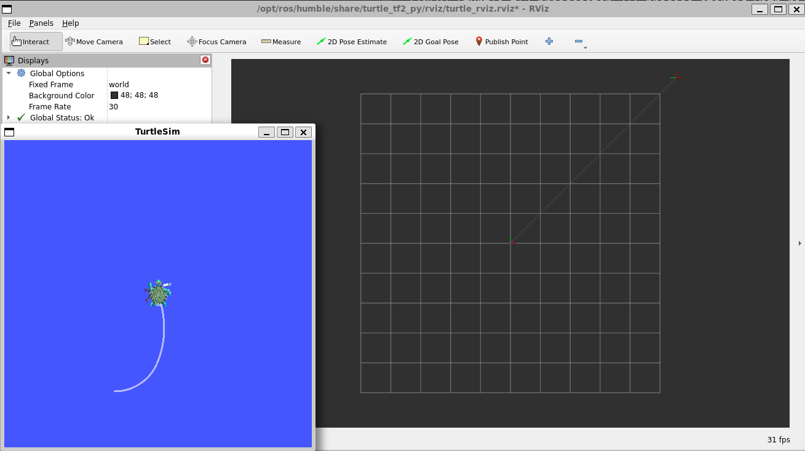

# tf2 Coordinate Frame Transform
In this ros2 tf2 tutorial, I will go over the tf2 packages that can be used to monitor the coordinate frame transform (transformation matrix) of your robot. We will start off by installing the required packages, run a turtle following tf2 demo, view the frames using the tf2 tools, and finally view the frames using rviz.



## Python References
If you need some python references, check out my python playlist: 
https://youtube.com/playlist?list=PLSK7NtBWwmpSUenWrmUh0ND_l023RPAXK&si=z1k563TJcVCJVJlc

- Python Class: 
https://youtu.be/5u8aovsCQhI?si=DLt_SoctiY3iMg5i
- Pyhon Inheritance: 
https://youtu.be/fSPGTQubT9w?si=uKdHU2sIFqS5RA3o
- Python 'if __name__ == '__main__'
https://youtu.be/yoAFfLf4GBA?si=Iu5Yw5SO-wEyXcA5


## Install Packages 
Install `tf2` and `rviz2` packages
```bash
sudo apt-get install ros-humble-rviz2 ros-humble-turtle-tf2-py ros-humble-tf2-ros ros-humble-tf2-tools ros-humble-turtlesim
```

## Run tf2 Demo
In this demo, we will spawn two turtles and have one turtle follow the other turtle by using tf2 broadcasters and tf2 listeners pass the turtle's coordinate frame transforms. 

In one terminal, launch the tf2 demo
```bash
ros2 launch turtle_tf2_py turtle_tf2_demo.launch.py
```

In another terminal, run the teleop
```bash
ros2 run turtlesim turtle_teleop_key
```

## View Frames using tf2 tools
Using the tf2 tools, we can view frame information by generate a pdf which we'll see first or by printing it out in the terminal which we'll see later on. 

To generate a pdf (frames_timestamp.pdf) of the useful information such as the frames, timestamps (Unix epoch format - ex: 1704564806.588186610), average rate (Hz), and buffer length. The frames used in this example are `world`, `turtle1`, and `turtle2`. 

```bash
ros2 run tf2_tools view_frames
```

To view the frames printed out in the terminal, we can use the tf2_echo command. This will print out the translation, rotation, and transformation matrix. 
```bash
# ros2 run tf2_ros tf2_echo [source_frame] [target_frame]
ros2 run tf2_ros tf2_echo turtle2 turtle1
```

## View Frames using Rviz
We can also view the frames graphically by using rviz
```bash
ros2 run rviz2 rviz2 -d $(ros2 pkg prefix --share turtle_tf2_py)/rviz/turtle_rviz.rviz
```

# Next Video:<br>tf2 Static Broadcaster Python
