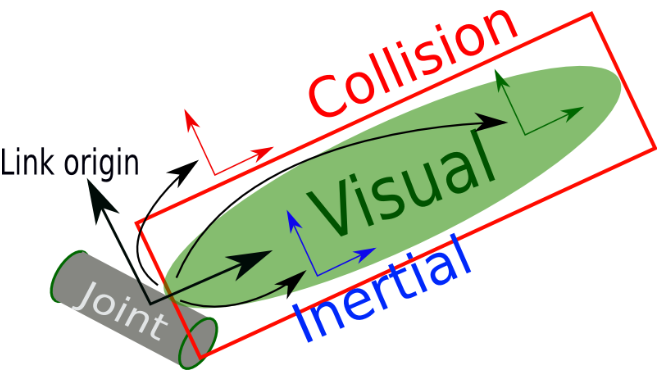

# URDF Tutorial - Describe Any Robot (Links and Joints)
In this URDF tutorial, I will show you how to describe any robot using links and joints. 

- [What is an URDF File? (General Structure)](#what-is-an-urdf-file-general-structure)
- [General Structure of a Link](#general-structure-of-a-link)
- [Visual](#visual)
- [Types of Geometries used in URDF File](#types-of-geometries-used-in-urdf-file)
- [Origin - rpy and xyz](#origin---rpy-and-xyz)
- [Material](#material)
- [Collision](#collision)
- [Inertial](#inertial)
- [Link Example](#link-example)
- [General Structure of a Joint](#general-structure-of-a-joint)
- [Types of Joints](#types-of-joints)
- [Parent and Child Link](#parent-and-child-link)
- [Origin and Axis](#origin-and-axis)
- [Dynamics](#dynamics)
- [Limit](#limit)
- [Joint Example](#joint-example)
- [Robot Example](#robot-example)

## What is an URDF File? (General Structure)
An URDF (Unified Robotics Description Format) file is an `.xml` file used to describe the visual, physics, and connections of a robot with joints and links. Below is the general structure of an URDF file

```xml
<?xml version="1.0"?>
<robot name="robot_name"> 
  <link name="link_name">
    <visual> 
    </visual>

    <collision> 
    </collision>

    <inertial> 
    </inertial>
  </link>

  <joint name="joint_name"...>
    <axis .../>
    <parent link .../>
    <child link .../>
    <origin .../>
  </joint>
</robot>
```

Generic Joint and Link: 



## Links in URDF
A link is used to describe a segment of a robot, where you can define the `visual`, `collision` and `inertial` properties. The `geometry` and `origin` properites are used in `visual` and `collision` properties to describe the shape and location of the link.  

### General Structure of a Link
```xml
<link name="link_name">
  <visual> <!-- OPTIONAL -->
    <geometry>
      <!-- Geometry Specific Code -->
    </geometry> <!-- REQUIRED -->
    <origin rpy="r p y" xyz="x y z"/> <!-- OPTIONAL -->
    <material name="color_name"/> <!-- OPTIONAL -->
  </visual>

  <collision> <!-- OPTIONAL -->
    <geometry> <!-- REQUIRED -->
      <!-- Geometry Specific Code -->
    </geometry>
    <origin rpy="r p y" xyz="x y z"/> <!-- OPTIONAL -->
  </collision>

  <inertial> <!-- OPTIONAL -->
    <mass value = "mass_in_kg"/>
    <inertia 
      ixx="ixx" ixy="ixy" ixz="ixz"
      iyy="iyy" iyz="iyz"
      izz="izz"/>
  </inertial>
</link>
```

### Visual
Visual is used to describe the geometry of the link. Usually this can be an accurate representation of the robot or just a simplified version depending on the goal. For accurate models, one can obtain the model from a 3D modeling software like Solidworks and export the `.stl` files for the geometry. 

### Types of Geometries used in URDF File 
Units for the geometries are in SI units, so meters for all lengths. For the mesh, the files types can be `.stl` or `.dae` files

```xml
<geometry>
  <!-- Geometry Specific Code -->
</geometry>
```

| Geometry | Geometry Specific Code        |
|-------------|----------------------------|
| box | ```<box size="x y z"/>``` |
| sphere |   ```<sphere radius="r"/>```|
| cylinder | ```<cylinder radius="r" length="l"/>```| 
| mesh | ```<mesh filename="file_path" scale="x y z"/>```| 

### Origin - rpy and xyz 
The origin is used to define the rotation [radians] using roll (x), pitch (y), yaw (z) and the translation [meters] using x, y, z relative to the link's coordinate frame. The order of rotation for rpy is ZYX, so first rotate about X axis, then Y axis and finally Z axis. 

For `visual` and `collision`, `origin` describes how the geometry is transformed relative to the link's frame. 

For `inertial`, `origin` describes the location of the center of mass relative to the link's frame. 

```xml
<origin rpy="r p y" xyz="x y z"/>
```

Axis Colors: 
| Axis | Color | 
| - | - | 
| X | Red | 
| Y | Green | 
| Z | Blue | 

### Material
The material is used to define the colors and the transparency of the color by using `rgba`, normalized between 0 and 1. 

```xml
<material name="color_name">
  <color rgba="r g b a"/>
</material>
```

Some common colors: 

|`color_name` | `r g b a` |
| - | - |
| red | 1 0 0 1|
| green | 0 1 0 1 |
| blue | 0 0 1 1 |
| yellow | 1 1 0 1| 
| cyan | 0 1 1 1 | 


### Collision
The collision property can be used to describe a bounding shape around the link for collision detection. Usually, people use a simplified shape for this for faster calculation when detecting for collisions between other collision bounding shapes. 

```xml
<collision> <!-- OPTIONAL -->
  <geometry> <!-- REQUIRED -->
    <!-- Geometry Specific Code -->
  </geometry>
  <origin rpy="r p y" xyz="x y z"/> <!-- OPTIONAL -->
</collision>
```

### Inertial
The `inertial` property is used to describe the inertia [kg&middot;m<sup>2</sup>] about the link's center of mass and the mass [kg] of the link. 

```xml
<inertial> <!-- OPTIONAL -->
  <mass value = "mass_in_kg"/>
  <inertia 
    ixx="ixx" ixy="ixy" ixz="ixz"
    iyy="iyy" iyz="iyz"
    izz="izz"/>
</inertial>
```

### Link Example
Let's examine a simple example with a cylinder in `simple-link.urdf` and then we can view it in rviz 
```bash
ros2 launch urdf_tutorial display.launch.py model:=urdf/01-simple-link.urdf
```

## Joints in URDF Files
Joints are used to describe the connections between two links, a `parent link` and a `child link`. 

### General Structure of a Joint
Below is the general structure of a joint. 

```xml
<?xml version="1.0"?>
<robot name="robot_name">
    ...
  <joint name="joint_name" type="joint_type">
  <!-- OPTIONAL -->
    <parent link="parent_link_name"/>
    <child link="child_link_name"/>
  <!-- REQUIRED -->
    <origin rpy="r p y" xyz="x y z"/> 
    <axis rpy="r p y" xyz="x y z"/> 
    <limit lower="lower" upper="upper" effort="max_effort" velocity="max_vel"/>
    <dynamics damping="damp_coef" friction="fric_coef"/> 
  </joint>
  ...
</robot>
```

### Types of Joints 
Options for `joint_type`
- `fixed` - no motion between links
- `continuous` - rotation about axis, not limit
- `revolute` - rotation about axis, with limits (in radians)
- `prismatic` - translation about axis
- `floating` - 6 DOF (3 translation, 3 rotation)
- `planar` - motion on plane (2 translation, 1 rotation)

### Parent and Child Link
The `parent link` is the link before the joint and the `child link` is the link after the joint. 

```xml
<parent link="parent_link_name"/>
<child link="child_link_name"/>
```

### Origin and Axis
The `origin` describes the location of the child frame relative to the parent frame. The `axis` describes the axis of rotation for the joint. 

```xml
<origin rpy="r p y" xyz="x y z"/> 
<axis rpy="r p y" xyz="x y z"/> 
```

### Dynamics 
The dyanamics include `damping` expressed in [N s/m] and `friction` (static friction) expressed in [N]. 

```xml
<dynamics damping="damp_coef" friction="fric_coef"/> 
```

### Limit
Limits are for `revolute` and `prismatic` joints only. The `lower` and `upper` field are in radians or meters respectively, the `effort` is the max effort in [Nm], and `velocity` is max velocity [rad/s]. 

```xml
<limit lower="lower" upper="upper" effort="max_effort" velocity="max_vel"/>
```

### Joint Example
Let's examine a simple joint with two links in `02-simple-joint.urdf` and then we can view it in rviz
```bash
ros2 launch urdf_tutorial display.launch.py model:=urdf/02-simple-joint.urdf
```

## Robot Example
We will be making a robot with 16 links and 15 joints! 

Below is a table showing the 16 links:

| Link Name            | Geometry Type |
|----------------------|---------------|
| base_link            | Cylinder      |
| right_leg            | Box           |
| right_base           | Box           |
| right_front_wheel    | Cylinder      |
| right_back_wheel     | Cylinder      |
| left_leg             | Box           |
| left_base            | Box           |
| left_front_wheel     | Cylinder      |
| left_back_wheel      | Cylinder      |
| gripper_pole         | Cylinder      |
| left_gripper         | Mesh          |
| left_tip             | Mesh          |
| right_gripper        | Mesh          |
| right_tip            | Mesh          |
| head                 | Sphere        |
| box                  | Box           |

Below is a table showing the 15 joints: 

| Joint Name                | Joint Type   | Parent Link       | Child Link          |
|---------------------------|--------------|-------------------|---------------------|
| base_to_right_leg         | Fixed        | base_link         | right_leg           |
| right_base_joint          | Fixed        | right_leg         | right_base          |
| right_front_wheel_joint   | Continuous   | right_base        | right_front_wheel   |
| right_back_wheel_joint    | Continuous   | right_base        | right_back_wheel    |
| base_to_left_leg          | Fixed        | base_link         | left_leg            |
| left_base_joint           | Fixed        | left_leg          | left_base           |
| left_front_wheel_joint    | Continuous   | left_base         | left_front_wheel    |
| left_back_wheel_joint     | Continuous   | left_base         | left_back_wheel     |
| gripper_extension         | Prismatic    | base_link         | gripper_pole        |
| left_gripper_joint        | Revolute     | gripper_pole      | left_gripper        |
| left_tip_joint            | Fixed        | left_gripper      | left_tip            |
| right_gripper_joint       | Revolute     | gripper_pole      | right_gripper       |
| right_tip_joint           | Fixed        | right_gripper     | right_tip           |
| head_swivel               | Continuous   | base_link         | head                |
| tobox                     | Fixed        | head              | box                 |


We can first take a look at the `03-robot-example.urdf` file and then run the robot example: 
```bash
ros2 launch urdf_tutorial display.launch.py model:=urdf/03-robot-example.urdf
```
# Next Video:<br>URDF Tutorial Xacro Files

# Reference
http://wiki.ros.org/urdf/XML/link
https://abedgnu.github.io/Notes-ROS/chapters/ROS/10_robot_modeling/urdf.html
https://docs.ros.org/en/humble/Tutorials/Intermediate/URDF/URDF-Main.html
