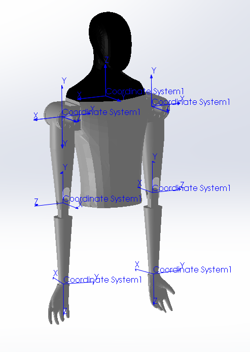

# ROS2 Gazebo Tutorial - Simulate Any Robot with Gazebo and ROS2 Control  
In this ROS2 gazebo tutorial, I will do a robot simulation in gazebo using ros2 control with the Tesla Bot Optimus!  


# Table of Contents
1. [Install Gazebo and ROS2 Control Packages](#install-gazebo-and-ros2-control-packages)
2. [Gazebo Tutorial Package Structure](#gazebo-tutorial-package-structure)
3. [Robot Coordinate Frames for URDF](#robot-coordinate-frames-for-urdf)
4. [CMakeLists.txt Updates](#cmakeliststxt-updates)
5. [Package.xml Updates](#packagexml-updates)
6. [Display Robot in Gazebo and Setup using Launch File](#display-robot-in-gazebo-and-setup-using-launch-file)
7. [Types of ROS2 Controllers](#types-of-ros2-controllers)
8. [Gazebo and ROS2 Control in URDF File](#gazebo-and-ros2-control-in-urdf-file)
9. [ROS2 Control Yaml File](#ros2-control-yaml-file)
10. [Simulate Robot in Gazebo with Joint Publisher](#simulate-robot-in-gazebo-with-joint-publisher)

By the end of this video, we will see Tesla Bot doing some air curls. 

## Install Gazebo and ROS2 Control Packages 
```bash
sudo apt-get update
sudo apt install ros-${ROS_DISTRO}-gazebo-ros-pkgs ros-${ROS_DISTRO}-ros2-control ros-${ROS_DISTRO}-ros2-controllers ros-${ROS_DISTRO}-gazebo-ros2-control
```

## Gazebo Tutorial Package Structure
> Package Created Using: 
> ```bash
> ros2 pkg create --build-type ament_python gazebo_tutorial
> ```

```
\gazebo_tutorial
├── \config                      # New Folder
│   └── joint_controller.yaml    # New File
├── \include 
├── \launch                      # New Folder
│   └── gazebo.launch.py         # New File
├── \meshes                      # New Folder
│   └── arm_lower.STL            # New File
│   └── arm_upper.STL            # New File
│   └── ...                      # New File
├── \src
│   └── joint_publisher.cpp      # New File
├── \urdf                        # New Folder
│   └── teslabot.urf.xacro       # New File
└── CMakeLists.txt               # Modified 
└── package.xml                  # Modified
```

## Robot Coordinate Frames for URDF
I'll be giving an overview of the coordinate frame definitions for the Tesla Bot and the main links and joints used. If you are new to URDF, I have a URDF Tutorial video!

**ROS2 URDF Tutorial - Describe Any Robot (Links and Joints)**

[](https://www.youtube.com/watch?v=LsKL8N5Iwkw)

All the joints are listed below with the parent link, child link and type. 

| Joint Name                 | Parent Link       | Child Link          | Type       |
|----------------------------|-------------------|---------------------|------------|
| world_to_head              | world             | head                | fixed      |
| head_to_body               | head              | body                | fixed      |
| body_to_shoulder_right     | body              | shoulder_right      | revolute   |
| body_to_shoulder_left      | body              | shoulder_left       | revolute   |
| shoulder_to_arm_upper_right| shoulder_right    | arm_upper_right     | revolute   |
| shoulder_to_arm_upper_left | shoulder_left     | arm_upper_left      | revolute   |
| arm_upper_to_lower_right   | arm_upper_right   | arm_lower_right     | revolute   |
| arm_upper_to_lower_left    | arm_upper_left    | arm_lower_left      | revolute   |
| arm_lower_to_hand_right    | arm_lower_right   | hand_right          | fixed      |
| arm_lower_to_hand_left     | arm_lower_left    | hand_left           | fixed      |

The revolute joints are all about the `z-axis` as shown below.



## CMakeLists.txt Updates 
Update `CMakeLists.txt`
1. Find Packages 
2. Create Executable for Joint Publisher
3. Copy Files to Desired Directories 

Let's see the changes made in our `.../CMakeLists.txt`. 

## Package.xml Updates 
Update `package.xml` to include dependencies for 
1. `rclcpp` 
2. `trajectory_msgs`. 

See changes in `.../packages.xml`.  

## Display Robot in Gazebo and Setup using Launch File 
The gazebo launch file is used to do the following.
1. Launch Gazebo - start up gazebo 
2. Robot State Publisher - publishes state of robot for visualization
3. Spawn Robot - display robot in gazebo  
4. Joint State Broadcaster - publishes state of robot for control
5. Joint Trajectory Controller - receives and controls robot joints 

Now let's take a look at our `../launch/gazebo.launch.py` file. 

Build, source, and run the launch file: 
```bash
cd ~/ros2_ws 
colcon build --packages-select gazebo_tutorial 
source install/setup.bash
ros2 launch gazebo_tutorial gazebo.launch.py
```

> NOTES: 
> 1. If it is your first time starting Gazebo, you may see a black screen for a minute or two before it's done loading. So don't freak out! 
> 2. If Gazebo isn't working properly, try to force quit gazebo.
> ```bash
> sudo killall -9 gazebo gzserver gzclient
> ```

## Types of ROS2 Controllers 
|Type|Msg|
|-|-|
|joint_trajectory_controller/JointTrajectoryController|common_interfaces/trajectory_msgs/msg/JointTrajectory.msg|
|effort_controllers/JointGroupEffortController|common_interfaces/std_msgs/msg/Float64MultiArray.msg|
|position_controllers/JointGroupPositionController|common_interfaces/std_msgs/msg/Float64MultiArray.msg|
|velocity_controllers/JointGroupVelocityController|common_interfaces/std_msgs/msg/Float64MultiArray.msg|
|diff_drive_controller/DiffDriveController|common_interfaces/geometry_msgs/msg/TwistStamped.msg|

Reference:
- ROS2 Controller Message Types: https://github.com/ros2/common_interfaces/tree/humble
- Gazebo ROS2 Control Examples: https://github.com/ros-controls/gazebo_ros2_control/tree/master


## Gazebo and ROS2 Control in URDF File 
I'll be going over the ros2 control and gazebo code blocks that you need to add to your URDF file. 

Depending on which type of controller you are using, you can read or send different types of interface. 
- `state_inferface`: read data
- `command_interface`: send data

Type of interfaces: 
- `position`
- `velocity`
- `effort`

```xml
<?xml version="1.0"?>
<robot name="robot" xmlns:xacro="http://ros.org/wiki/xacro">
  <!-- Links and Joints -->
    ...
  <!-- ROS2 Control -->
  <ros2_control name="GazeboSystem" type="system">
    <hardware>
      <plugin>gazebo_ros2_control/GazeboSystem</plugin>
    </hardware>
    <!-- Joint 1 -->
    <joint name="joint_name">
      <command_interface name="interface_name">
        ...
      </command_interface>
      <state_interface name="interface_name">
        ...
      </state_interface>
    </joint>
    <!-- Joint N -->
    <joint name="joint_name">
        ...
    </joint>
  </ros2_control>
  
  <!-- Gazebo -->
  <gazebo>
    <plugin filename="libgazebo_ros2_control.so" name="gazebo_ros2_control">
      <parameters>$(find gazebo_tutorial)/config/joint_controller.yaml</parameters>
    </plugin>
  </gazebo>
</robot>
```

Now let's take a look at our `../urdf/teslabot.urdf.xacro` file. 


## ROS2 Control Yaml File 
The `.yaml` file will be specific to the type of controller that you are using, but here is the general structure. 

```yaml
controller_manager:
  ros__parameters:
    update_rate: update_rate_in_hz

    name_of_controller:
      type: name_of_controller

    joint_state_broadcaster:
      type: joint_state_broadcaster/JointStateBroadcaster

name_of_controller:
  ros__parameters:
    joints:
      - name_of_joint_1
      - ...
      - name_of_joint_n
    interface_name: name_of_interface
    command_interfaces:
      - name_of_interface
    state_interfaces:
      - name_of_interface
```

Now let's take a look at our `../config/joint_controller.yaml` file. 

## Simulate Robot in Gazebo with Joint Publisher
Finally, we will go over the joint publisher used to simulate our robot in gazebo. Based on the type of messages used for the joint trajectory controller, we can figure out how to send the joint positions in the correct format in our publisher. 

Here is the definition for the `JointTrajectory` message,

```bash
# common_interfaces/trajectory_msgs/msg/JointTrajectory.msg

std_msgs/Header header
string[] joint_names
JointTrajectoryPoint[] points
```

which uses the `JointTrajectoryPoint` message. 
```bash
# common_interfaces/trajectory_msgs/msg/JointTrajectoryPoint.msg

float64[] positions
float64[] velocities
float64[] accelerations
float64[] effort
builtin_interfaces/Duration time_from_start
```

Now let's take a look at our `../src/joint_publisher.cpp` file. 

To simulate the robot using the `joint_publisher`, we can run the executable. Make sure to run the `gazebo.launch.py` in another terminal as discussed earlier. 
```bash
cd ~/ros2_ws
source install/setup.bash
ros2 run gazebo_tutorial joint_publisher
```


# Q&A 
##  1. Wrong Permission Error
Error: 
[gzclient-2] [Wrn] [GuiIface.cc:120] QStandardPaths: wrong permissions on runtime directory /run/user/1000/, 0755 instead of 0700

Solution:
chmod 0700 /run/user/1000/


## 2. Origin in STL File Not Correct 
Solution: 
Check `Do Not translate STL output data to positive space
